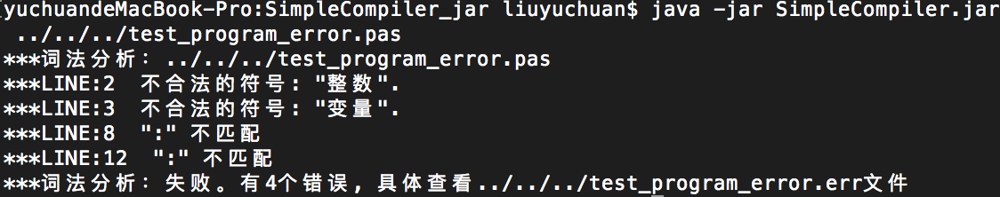

# SimpleCompiler
## 运行环境
JRE 1.8及以上


## 使用

### Jar方式

```
java -jar SimpleCompiler.jar test_program.pas
```

### 编译运行

```
# 编译(src目录下)
javac SimpleCompiler.java constant/* parser/* word/*
# 运行
java SimpleCompiler test_program.pas
```

## 测试文件说明

**test_program.pas**: PPT上的代码，有一个m未定义的错误。运行结果：


**test_program_ok.pas**: PPT上的代码，消除了m未定义错误的代码。运行结果：


**test_program_ok_multi.pas**: 语法正确，具有多个嵌套过程，不同过程重复变量名的代码。运行结果：


**test_program_error.pas**: 有词法错误的代码。运行结果：


**test_program_syntax_error.pas**: 基于PPT代码，添加了多个错误的代码。运行结果如下：


## 生成文件说明
当通过词法和语法分析后，除了源文件外，会生成四个文件：


**dyd文件**：词法分析结果，二元式。

**err文件**：错误信息文件

**pro文件**：过程表

**var文件**：变量表